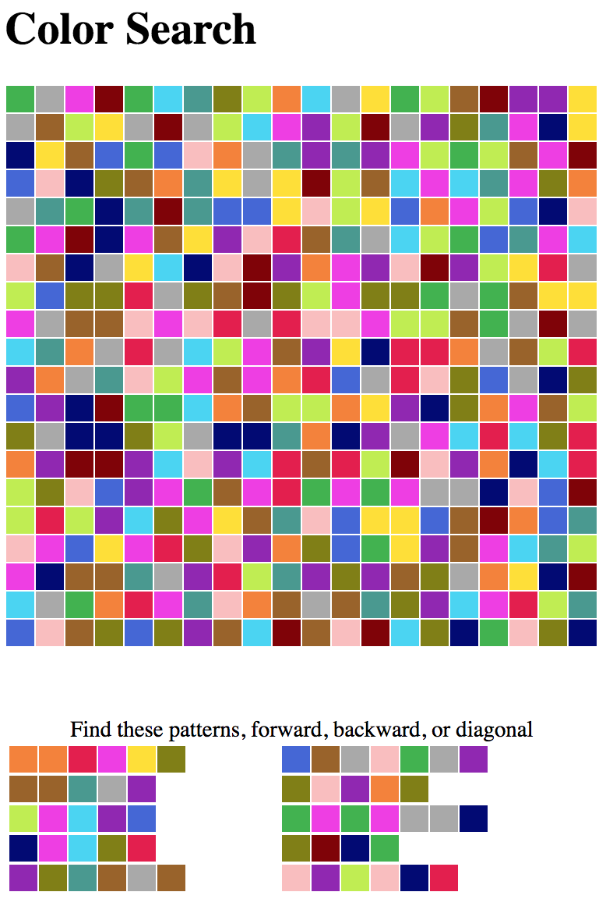

# Color Search

Like word searches but with colors.

I made this for a Christmas present for a dyslexic friend and she loved it.

Check out https://sashat.me/2017/01/11/list-of-20-simple-distinct-colors/ for where I got the colors from.

Compile and run the go program and it will output 20 puzzles in a HTML file.
You can then print this and it will print one per page. If you cut all the
pages in half you can make a little booklet out of them.

There are some knobs in the go code that can be tweaked.

disclaimer: The go is terrible and it uses HTML tables like crazy. I'm pragmatic.

MIT License
